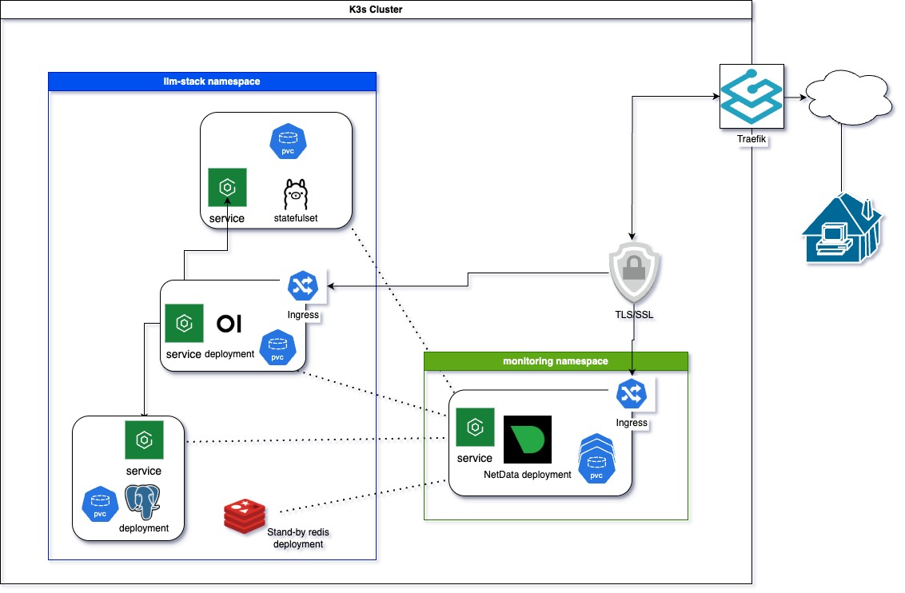

# darien_test Implementation Takeaways

## Architecture Overview


## Kubernetes Cluster Deployment
- Used K3s Kubernetes cluster distribution as it works well in resource-constrained environments. It simplifies Kubernetes by eliminating non-essential components, making it easier to install, manage, and run than standard Kubernetes.

## Ingress controller 
- Used Traefik because is deployed by default when starting the K3s server. Also, I had to add custom parameters to the default `traefik.yaml` config file /var/lib/rancher/k3s/server/manifests/ path. 
- Added a sample file to the repository so that it can reviewed by the team, but the custom parameters added were:

```bash
    certificatesResolvers:
      letsencrypt:
        acme:
          email: jesbar02@gmail.com
          storage: /data/acme.json
          httpChallenge:
            entryPoint: web
    additionalArguments:
      - "--entrypoints.web.address=:80"
      - "--entrypoints.websecure.address=:443"
      - "--certificatesresolvers.letsencrypt.acme.httpchallenge=true"
      - "--certificatesresolvers.letsencrypt.acme.httpchallenge.entrypoint=web"
      - "--certificatesresolvers.letsencrypt.acme.email=jesbar02@gmail.com"
      - "--certificatesresolvers.letsencrypt.acme.storage=/data/acme.json"
```
This allowed me to manage self-hosted letsencrypt TLS cetificates and enable them to be used by traefik.
Ref: https://doc.traefik.io/traefik/user-guides/crd-acme/

## OpenWebUI + Ollama Deployment
- This implementation is running on the `llm-stack` namespace.
- For the sake of simplicity, I implemented generic secrets to handle `username password db_url` information the will be requested from the openwebui and postgres services.
This can be implemented with more robust third-party services offered by specialized providers. 
I keep the `db-secrets.yaml` file in my local PC, but is hidden by `.gitignore` feature so that is not exposed in the remote branch.
- Leveraged on the sample manifest files found at https://github.com/open-webui/open-webui/tree/main/kubernetes/manifest.
- Added redis deployment for possible content caching. Not fully implemented.
- Added some PCV claims to avoid any data to be lost after applying new deployments.
- Added an ingress resource for public access to the application and used traefik to route the incomming requests.
- On ollama's deployment, I need to add an script to pull models at deployments run-time.

```bash
        lifecycle:
          postStart:
            exec:
              # Pull one or more models here; adjust model names as needed
              command:
                - /bin/sh
                - -c
                - |
                  echo "Starting model pull..."
                  ollama pull llama3.1
                  ollama pull mistral
                  echo "Model pull complete."
```

## Netdata deployment
- This implementation is running on the `monitoring` namespace.
- Used helm charts to deploy Netdata.
- Added an ingress resource for public access to the application and used traefik to route the incomming requests.

Ref:  https://learn.netdata.cloud/docs/netdata-agent/installation/kubernetes-helm-chart-reference

## CD pipeline
- Used the built-in `Actions` tool as is fully integrated within my GitHub account
- In order to connect to the stand-alone Server and apply automated deployments into the K3s cluster, I created a Secret with information extracted from the cluster's kube config.
 
## openwebui access
```txt
User admin
Email admin@devops-jh.darienc.com
Password Darient123
```